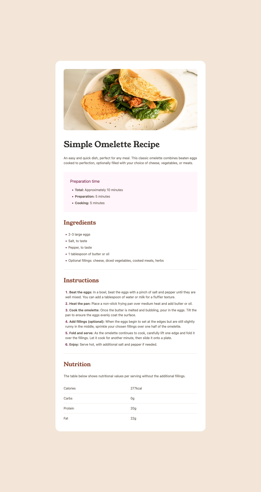
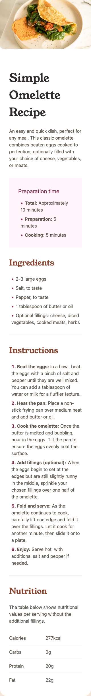

# Frontend Mentor - Recipe Page Solution

This is my solution to the [Recipe Page challenge on Frontend Mentor](https://www.frontendmentor.io/challenges/recipe-page-KiTsR8QQKm).  
The challenge focuses on building a clean, semantic, and responsive recipe layout using HTML and CSS.

---

## 📸 Screenshots

### 🖥️ Desktop View

### 📱 Mobile View

---

## 🔗 Links

- **Solution URL:** https://github.com/<your-username>/recipe-page-component-04  
- **Live Site URL:** https://recipe-page-component-04.netlify.app/

---

## 🛠️ Built With

- Semantic **HTML5**
- **CSS custom properties**
- **Flexbox**
- **Responsive design**
- **Mobile-first workflow**
- **Tailwind CSS** (for styling)
- Utilized **semantic tables**, **lists**, and **accessible markup**

---

## 📚 What I Learned

Working on this project helped me:

- Improve my use of **semantic HTML**, especially with sections like `<article>`, `<section>` and accessible tables.
- Understand how to build **mobile-first layouts** using Tailwind and refine breakpoints.
- Work with **Tailwind utilities** for spacing, typography, and responsive design.
- Create **accessible lists**, including the use of custom markers where needed.
- Structure nutritional information using proper `<table>` semantics (`<thead>`, `<tbody>`, `<th scope="row">`).